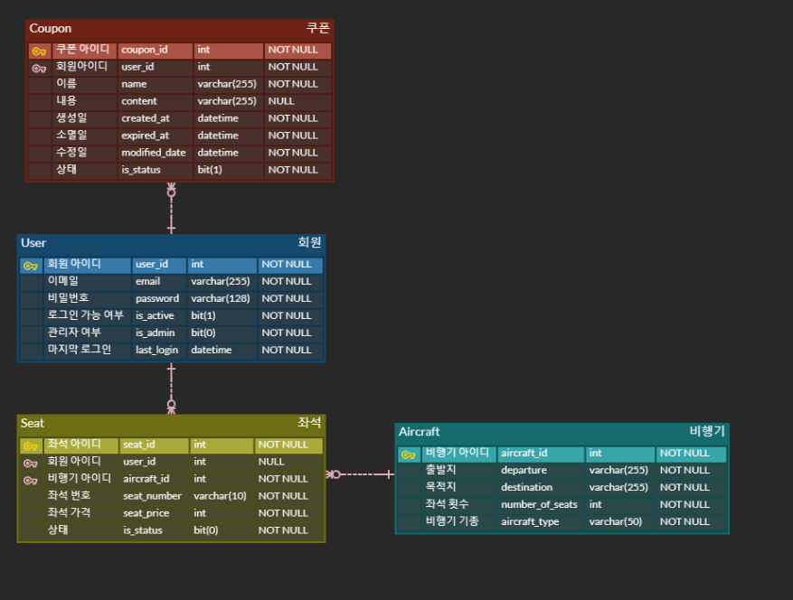

# Django Transaction 프로젝트 
## ****📌 프로젝트 개요****
- Django를 활용하여 Transaction를 공부하는 것이 목적
- 개발기간 : '23.02.19 ~ '

<br>

## ****⛓ Tech Stack****  
### Backend :    
### Management :  
### Database : 

<br>

## 📚 ****깃 컨벤션 전략****

<details>
<summary>Git Message 컨벤션</summary>
<div markdown="4">

```
################
# <타입> : <제목> 의 형식으로 제목을 아래 공백줄에 작성
# 제목은 50자 이내 / 변경사항이 "무엇"인지 명확히 작성 / 끝에 마침표 금지
# 예) :sparkles:Feat: 로그인 기능 추가, 
# 바로 아래 공백은 지우지 마세요 (제목과 본문의 분리를 위함)
################
# 본문(구체적인 내용)을 아랫줄에 작성
# 여러 줄의 메시지를 작성할 땐 "-"로 구분 (한 줄은 72자 이내)

################
# 꼬릿말(footer)을 아랫줄에 작성 (현재 커밋과 관련된 이슈 번호 추가 등)
# 예) Close #7, related_to: #7 
​
################
# :sparkles:Feat: 새로운 기능 추가
# :bug:Fix: 버그 수정
# :ambulance:!HOTFIX: 급한 오류 수정
# :books:Docs: 문서 수정
# :umbrella:Test: 테스트 코드 추가
# :hammer:Refact: 코드 리팩토링
# :art:Style: 코드 의미에 영향을 주지 않는 변경사항
# :lipstick:Design: CSS 등 사용자 UI디자인 변경
# :Comment: 필요한 주석 추가 및 변경  
# :Rename: 파일 혹은 폴더명을 수정하거나 옮기는 작업만의 경우
# :Remove: 파일을 삭제하는 작업만 수행한 경우
# Chore: 빌드 부분 혹은 패키지 매니저 수정사항
################
```

</div>
</details>

<br>

## 🔨 ****프로젝트 시작하기****

<br>

## 🛢 ****[Database ERD](https://www.erdcloud.com/d/iZHLrmmWZZR9AjuLo)****


<br>

## 🎯 ****API****

<br>

## 🤙 ****Test Code Case****