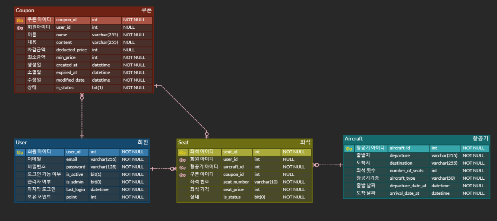

# Django Transaction 프로젝트 
## ****📌 프로젝트 개요****
- Django를 활용하여 Transaction를 공부하는 것이 목적
- 간단한 항공편 예약하는 서비스
- 개발기간 : '23.02.19 ~ 23.02.26'

<br>

## ****⛓ Tech Stack****  
### Backend :    
### Management :  
### Database : 

<br>

## 📚 ****깃 컨벤션 전략****

<details>
<summary>Git Message 컨벤션</summary>
<div markdown="4">

```
################
# <타입> : <제목> 의 형식으로 제목을 아래 공백줄에 작성
# 제목은 50자 이내 / 변경사항이 "무엇"인지 명확히 작성 / 끝에 마침표 금지
# 예) :sparkles:Feat: 로그인 기능 추가, 
# 바로 아래 공백은 지우지 마세요 (제목과 본문의 분리를 위함)
################
# 본문(구체적인 내용)을 아랫줄에 작성
# 여러 줄의 메시지를 작성할 땐 "-"로 구분 (한 줄은 72자 이내)

################
# 꼬릿말(footer)을 아랫줄에 작성 (현재 커밋과 관련된 이슈 번호 추가 등)
# 예) Close #7, related_to: #7 
​
################
# :sparkles:Feat: 새로운 기능 추가
# :bug:Fix: 버그 수정
# :ambulance:!HOTFIX: 급한 오류 수정
# :books:Docs: 문서 수정
# :umbrella:Test: 테스트 코드 추가
# :hammer:Refact: 코드 리팩토링
# :art:Style: 코드 의미에 영향을 주지 않는 변경사항
# :lipstick:Design: CSS 등 사용자 UI디자인 변경
# :Comment: 필요한 주석 추가 및 변경  
# :Rename: 파일 혹은 폴더명을 수정하거나 옮기는 작업만의 경우
# :Remove: 파일을 삭제하는 작업만 수행한 경우
# Chore: 빌드 부분 혹은 패키지 매니저 수정사항
################
```

</div>
</details>

<br>

## 🔨 ****프로젝트 시작하기****

<br>

## 🛢 ****[Database ERD](https://www.erdcloud.com/d/iZHLrmmWZZR9AjuLo)****


<br>

## 🎯 ****API****

<br>

## ⚙ ****기능 명세서****
## 회원 기능
1. 회원가입
   - 이메일, 비밀번호, 비밀번호 재입력으로 회원가입
   - 비밀번호는 암호화(set_password)가 되어 저장
   - 이메일, 비밀번호 유효성 검사, 중복 검사 

<br>

2. 로그인(DRF Simple JWT 사용)
   - JWT 기반 인증
   - JWT에는 사용자 email과 id가 존재
   - Refresh Token 으로 Access Token 발급해줌
   - Refresh Token과 Access Token 유효기간은 각각 7일/1일
   - Refresh Token과 Access Token이 유효성은 Verify Token View으로 확인 가능 

<br>

3. 출석체크
    - 출석체크를 할 경우 10000포인트를 지급
    - 이중으로 포인트를 받을 수 없음

<br>

## 항공편 기능 
### ****구체적인 날짜와 항공사 등은 트랜잭션 연습이 주 목적이기에 기능 생략****
1. 항공편 등록 기능
   - 관리자만 등록할 수 있음
   - 항공편 출발지, 도착지, 좌석 횟수, 비행기 기종, 출발 날짜, 도착 날짜를 등록할 수 있음

<br>

2. 항공편 수정 기능
   - 관리자만 수정할 수 있음
   - 항공편 출발지, 도착지, 좌석 횟수, 비행기 기종, 출발 날짜, 도착 날짜를 수정할 수 있음
  
<br>

3. 항공편 삭제 기능
    - 관리자만 삭제할 수 있음
    - 항공편 삭제할 수 있음

<br>

4. 모든 항공편 읽기
    - 회원만 조회 가능 
    - 등록되어있는 모든 항공편은 읽을 수 있음

<br>

5. 해당하는 날짜의 항공편 읽기
    - 회원만 조회 가능
    - url 매개변수로 해당 날짜에 있는 항공편을 가져옴

<br>

## 좌석 예약
### ****transaction lock 사용****
1. 좌석 등록
   - 관리자만 등록할 수 있음
   - 항공기에 등록되어있는 좌석 횟수를 넘게 등록 불가

<br>

1. 좌석 삭제
   - 관리자 삭제할 수 있음

<br>

2. 좌석 수정
   - 관리자만 수정할 수 있음

<br>

3. 좌석 예약
   - 회원만 가능
   - 좌석을 등록할 때 transaction lock 걸기
   - url 매개변수로 좌석 가격에 맞게 보유 포인트 차감(쿠폰 사용 가능)

<br>

4. 좌석 예약 취소
   - 회원만 가능
   - 좌석을 취소하면 해당 좌석 가격만큼 보유 포인트 반환(쿠폰 사용여부 판단 후 반환)

<br>

5. 예약한 모든 좌석 읽기
   - 회원만 가능
   - 내가 예약한 좌석들 모두 읽기


## 쿠폰 
1. 쿠폰 생성
   - 관리자만 가능

<br>

2. 쿠폰 수정
   - 관리자만 가능
   - 쿠폰 수정 가능

<br>

3. 쿠폰 삭제
   - 관리자만 가능
   - 쿠폰 삭제 가능

<br>

4. 쿠폰 얻기
   - 회원만 가능
   - 쿠폰을 얻을 수 있음(중복 불가)

<br>

## 🤙 ****Test Code Case****

<br>